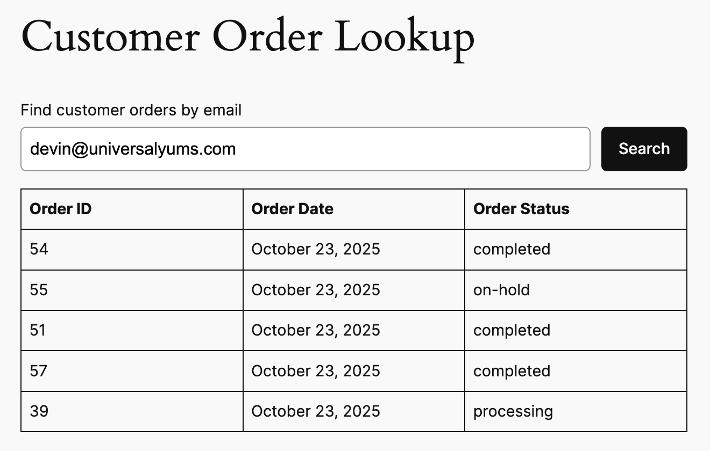

# Yums Order Lookup 

This extension enables a custom block to find orders in WooCommerce. Search for orders using the customer email address, and it will return all orders associated with that customer. It displays the order ID, order date, and order status in a table.



This WooCommmerce Extension was scaffolded using [Create Woo Extension](https://github.com/woocommerce/woocommerce/blob/trunk/packages/js/create-woo-extension/README.md).

Files were stubbed out and unit test infastructure added by the Universal Yums.

## Instructions

Here's a video explaining what we're looking for:
https://www.loom.com/share/3d4d0c389f7b417d8446f3c91bd5dd8c

- Create the markup for the block in React. This can be done in block.js. editor.js renders in the editor, and frontend.js renders on the frontend of the website.
- Write an API endpoint to fetch data for the block. This code can be added to includes/api.php.
- You will need to write at least one test. This can be done in tests/Integration or tests/Unit.

## Getting Started

You will need a local version of WordPress for development. You can use whatever development environment you prefer (Local, Studio, Laravel Valet, etc.)

You'll need to install WordPress and WooCommerce.

Clone this extension into your plugins directory.

When you finish development, you can either create a private fork and send me a link to review (devinsays on GitHub) or email a zip file to devin@wptheming.com.

### Installation and Build

Install composer dependencies:

```
composer install
```

Install javascript dependencies:

```
npm install
```

(Run `npm run build` or `npm run watch` to build files.)

## Tests

Automated test status: .

Tests will run automatically on GitHub when you push a commit.

To run PHPUnit locally, please refer to tests/readme.md.
